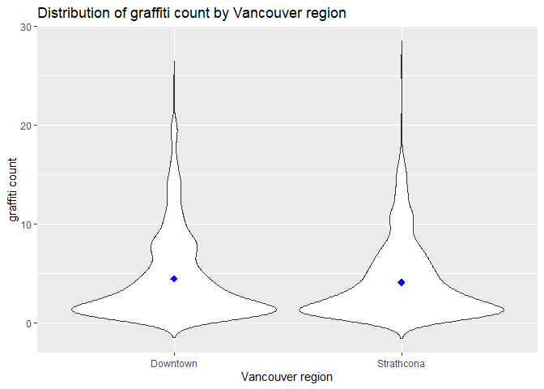

Exploratory data analysis of Vancouver Graffiti Data
================

Summary of the dataset
======================

The dataset used in this project provides information on the location of
sites with graffiti as identified by City staff. It is sourced from the
[Vancouver Open Data Portal](https://opendata.vancouver.ca/pages/home/),
specifically [this
file](https://opendata.vancouver.ca/explore/dataset/graffiti/information/).
The license of data can be found
[here](https://opendata.vancouver.ca/pages/licence/).

There are 8,028 rows and 3 columns in our dataset. Each row in the
dataset records the counts the number of graffiti incidents by the
geographic local area of Vancouver along with the spatial representation
of the location by coordinates stored as JSON format.

    ## # A tibble: 6 x 3
    ##   COUNT `Geo Local Area`      Geom                                              
    ##   <dbl> <chr>                 <chr>                                             
    ## 1     1 Kitsilano             "{\"type\": \"Point\", \"coordinates\": [-123.185~
    ## 2     5 Kensington-Cedar Cot~ "{\"type\": \"Point\", \"coordinates\": [-123.059~
    ## 3     6 Downtown              "{\"type\": \"Point\", \"coordinates\": [-123.100~
    ## 4     6 Downtown              "{\"type\": \"Point\", \"coordinates\": [-123.100~
    ## 5     1 Riley Park            "{\"type\": \"Point\", \"coordinates\": [-123.099~
    ## 6     7 Kitsilano             "{\"type\": \"Point\", \"coordinates\": [-123.148~

    ## Rows: 8,028
    ## Columns: 3
    ## $ COUNT            <dbl> 1, 5, 6, 6, 1, 7, 7, 5, 1, 1, 2, 12, 3, 1, 9, 2, 1...
    ## $ `Geo Local Area` <chr> "Kitsilano", "Kensington-Cedar Cottage", "Downtown...
    ## $ Geom             <chr> "{\"type\": \"Point\", \"coordinates\": [-123.1853...

We are investigating into 2 local areas of Vancouver; they are the
‘Downtown’ and the ‘Strathcona’ regions. We attempt to conduct a
hypothesis testing with a suitable test flavor to answer a statistical
research question, that is, whether the number of graffiti per location
of Vancouver’s downtown area differs from the number of graffiti per
location of the Vancouver Strathcona area.

After selecting relevant columns, there are 2,121 observations related
our research interest and below we show the number of observations for
each interested Vancouver region and the first few line of the dataset .

    ## [1] "Number of rows: 2121"

    ## # A tibble: 6 x 2
    ##   count geo_local_area
    ##   <dbl> <chr>         
    ## 1     6 Downtown      
    ## 2     6 Downtown      
    ## 3     2 Strathcona    
    ## 4     9 Downtown      
    ## 5     2 Downtown      
    ## 6     1 Downtown

| Downtown | Strathcona |
|---------:|-----------:|
|     1084 |       1037 |

Table 1. Counts of observation for each class.

Exploratory analysis on the dataset
===================================

From the below violin plot of the distributions of two classes, we can
observe the sample distributions are skewed to the right. Based on the
data visualizations, we can say a suitable estimator for our research
question is the median because we are interested in the most common
number of the graffiti in the two regions and the central tendency of
the distribution is most helpful for this given the shape of this sample
distribution is bell-shaped and skewed to the right. The long right tail
of the distributions also make the median the suitable test flavor
because median is not as sensitive to extreme values as it is
mathematically defined by the middle value of a distribution.

<!-- -->

Figure 1. Distribution of graffiti count by Vancouver region

Reference
---------

“Graffiti.” City of Vancouver Open Data Portal, 3 Feb. 2020,
<https://opendata.vancouver.ca/explore/dataset/graffiti/information/>.
